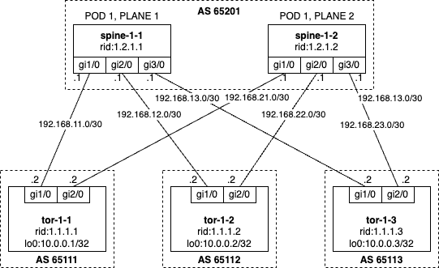

# Cisco DC Lab

### Introduction

This lab shows us example of DC networks. During the lab you do:
- deploy whole configuration on ToRs and Spines
- change role one of the tor to unknown role and deploy configuration on the tor and every spine
- set maintenance tag on one of the spines and deploy configuration on the spine

Author:
- [Grigorii Solovev](https://github.com/gs1571)

### Objectives

- Understand main principals of writing annet generators

## Preparation

Before you start please put into `../vm_images` Cisco IOS image `c7200-jk9s-mz.124-13a.bin`

## Topology



Naming:
- Spine - `spine-<pod>-<plane>`
- ToR - `tor-<pod>-<num>`
- Router ID Spine - `1.2.<pod>.<plane>`
- Router ID ToR - `1.1.<pod>.<num>`
- ASNUM Spine - `6520<pod>`
- ASNUM ToR - `6510<pod><num>`

### Generators

In this lab, generators are organized within the `./src/lab_generators` directory. The lab utilizes two specific generators:
- Hostname
- Interface IP addresses, descriptions and shutdown
- Route map
- BGP process

#### Hostname

The default configuration has basic names like a `tor` or `spine`, the generator set hostname to the names are taken from Netbox.

[src](./src/lab_generators/hostname.py)

#### Interface descriptions

Follow the connections in Netbox descriptions on the interfaces are created as `remote_hostname@remote_port`. 

[src](./src/lab_generators/description.py)

#### Interface shutdown

The generator set `no shutdown` to every interfaces on the device. 

[src](./src/lab_generators/description.py)


#### Interface IP addresses

The lab has two kind of IP addresses:
1. IP addresses know from Netbox
2. IP addresses on links between ToR and Spines which generated by math (based on ToR num and Spine pod). These addresses generated only of the device has role `ToR` or `Spine`.

The generator collected two kind of addresses and assign them to interfaces.

[src](./src/lab_generators/ip_address.py]

#### Route map

For the BGP neighbors and redistribute connected route-maps are needed, they should be generated before BGP process. Some interesting thing is checking tag `maintenance` on Spine and apply drain traffic logic there. The role is also important for the generator.

[src](./src/lab_generators/rpl.py)

#### BGP process

BGP neighbors also depend on connections in Netbox, they generated only if connection presents. And again very important role of the device.
Some attributes of BGP process like a AS and router-id are generated by math like IP addresses on links.

[src](./src/lab_generators/bgp.py]

### Lab Guide

**Step 1.**

To start lab please navigate to `annetutils/labs` and run `make lab03`.

**Step 2.** 

Go to annet-container  
```
docker exec -u root -t -i annet /bin/bash
```

Enable SSH on Cisco routers by script:
```
/home/ubuntu/scripts/netsshsetup/netsshsetup -a 172.20.0.100 -v cisco -b ios -l annet -p annet -P telnet --hostname lab-r1.nh.com
/home/ubuntu/scripts/netsshsetup/netsshsetup -a 172.20.0.101 -v cisco -b ios -l annet -p annet -P telnet --hostname lab-r2.nh.com
/home/ubuntu/scripts/netsshsetup/netsshsetup -a 172.20.0.102 -v cisco -b ios -l annet -p annet -P telnet --hostname lab-r3.nh.com
/home/ubuntu/scripts/netsshsetup/netsshsetup -a 172.20.0.103 -v cisco -b ios -l annet -p annet -P telnet --hostname lab-r2.nh.com
/home/ubuntu/scripts/netsshsetup/netsshsetup -a 172.20.0.104 -v cisco -b ios -l annet -p annet -P telnet --hostname lab-r3.nh.com
```

**Step 3.** 

Go to annet-container  
```
docker exec -u root -t -i annet /bin/bash
```

Generate configuration for spine-1-1, spine-1-2, tor-1-1, tor-1-2, tor-1-3

`python3 -m annet.annet gen spine-1-1.nh.com spine-1-2.nh.com tor-1-1.nh.com tor-1-2.nh.com tor-1-3.nh.com`

Look at diff

`python3 -m annet.annet diff spine-1-1.nh.com spine-1-2.nh.com tor-1-1.nh.com tor-1-2.nh.com tor-1-3.nh.com`

Deploy it

`python3 -m annet.annet deploy spine-1-1.nh.com spine-1-2.nh.com tor-1-1.nh.com tor-1-2.nh.com tor-1-3.nh.com`

**Step 4.**

Assign "Unknown" role to one of the ToR's and deploy configuration on the ToR and every Spine.

Go to the [Netbox](http://localhost:8000/), use annet:annet as login:password. Assign tor-1-1.nh.com role "Unknown".

Look at diff

`python3 -m annet.annet diff spine-1-1.nh.com spine-1-2.nh.com tor-1-1.nh.com tor-1-2.nh.com tor-1-3.nh.com`

Deploy it

`python3 -m annet.annet deploy spine-1-1.nh.com spine-1-2.nh.com tor-1-1.nh.com tor-1-2.nh.com tor-1-3.nh.com`

Restore the role and repeat the actions.

**Step 5.**

Break a connection and  check what happening.

Go to the [Netbox](http://localhost:8000/), use annet:annet as login:password. Delete connection between tor-1-1.nh.com and spine-1-1.nh.com.

Look at diff

`python3 -m annet.annet diff spine-1-1.nh.com spine-1-2.nh.com tor-1-1.nh.com tor-1-2.nh.com tor-1-3.nh.com`

Deploy it

`python3 -m annet.annet deploy spine-1-1.nh.com spine-1-2.nh.com tor-1-1.nh.com tor-1-2.nh.com tor-1-3.nh.com`

Restore the connection and repeat the actions.

**Step 6.**

Drain traffic from on of the Spine.

Go to the [Netbox](http://localhost:8000/), use annet:annet as login:password. Assign spine-1-1.nh.com tag "maintenance".

Look at diff

`python3 -m annet.annet diff spine-1-1.nh.com spine-1-2.nh.com tor-1-1.nh.com tor-1-2.nh.com tor-1-3.nh.com`

Deploy it

`python3 -m annet.annet deploy spine-1-1.nh.com spine-1-2.nh.com tor-1-1.nh.com tor-1-2.nh.com tor-1-3.nh.com`

Remove the tag and repeat the actions.

